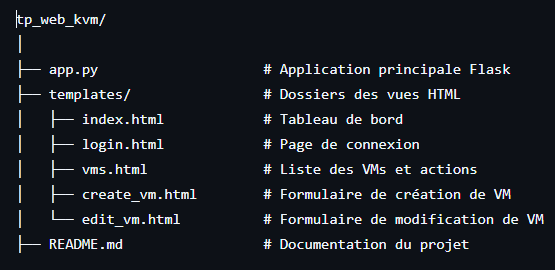

# Gestionnaire de Machines Virtuelles avec Flask et KVM

Cette application web développée en Python avec Flask permet de gérer des machines virtuelles KVM via une interface web.


## Prérequis

### Système

- Distribution Linux avec KVM et libvirt installés
- Exemples de paquets requis :
  - `qemu-kvm`
  - `libvirt`
  - `virt-manager`

### Python

- Python 3.9 ou plus
- Modules Python : pip install flask flask-session
- Libvirt pour Python sous Debian :
  ```
  sudo apt install python3-libvirt
  ```

## Fonctionnalités

- Accès à l’interface sécurisé par authentification PAM (utilisateurs système)
- Connexion à un hyperviseur distant via SSH
- Affichage de la liste des machines virtuelles actives et inactives
- Création de VM avec définition du nom, de la mémoire, du nombre de vCPU, de la taille disque et du fichier ISO
- Modification des ressources (mémoire et vCPU) si la VM est arrêtée
- Démarrage et arrêt d’une VM
- Mise en pause et reprise d’une VM
- Sauvegarde et restauration d’une VM
- Suppression d’une VM

## Architecture du projet



## Lancer l'application

Depuis le dossier du projet : python app.py

Accéder ensuite à via le navigateur web : http://localhost:5000

## démo de l'application 


